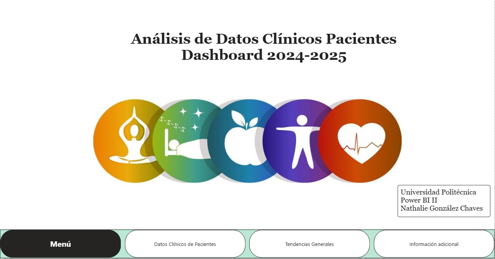
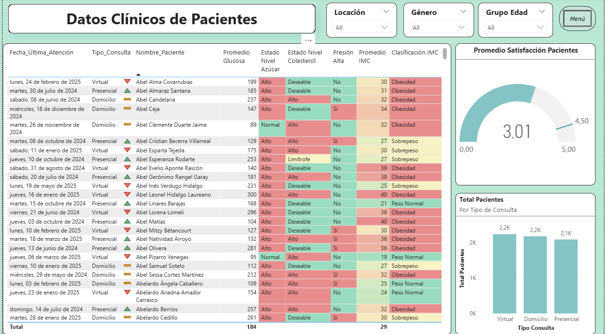
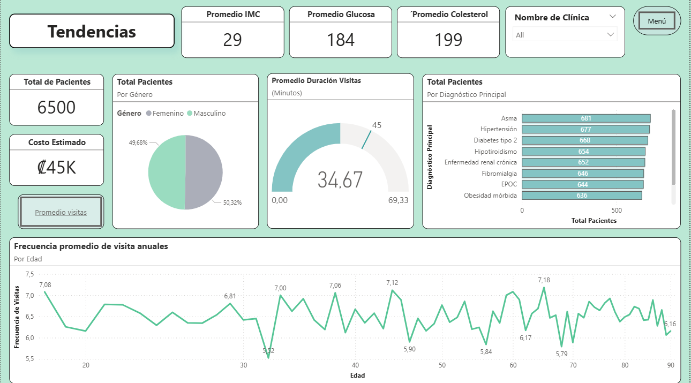
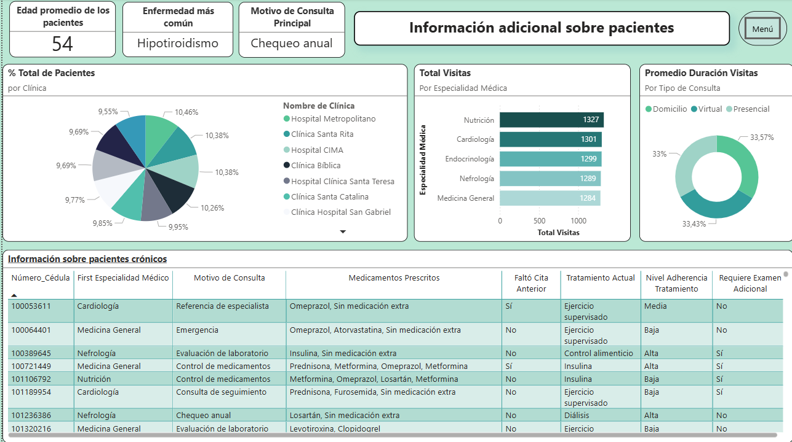
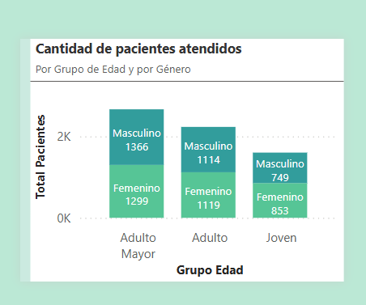

# Clinical Data Analytics Dashboard (Power BI)

## Dashboard Preview






---

## Project Overview
An end-to-end interactive Business Intelligence solution built in Power BI to analyze medical and administrative data from patients (2024–2025). This dashboard transforms raw healthcare records into actionable insights to optimize patient monitoring and support administrative decision-making.

### Key Features & Insights:
* **Demographic Segmentation:** Classified patient cohorts into distinct age groups (Joven, Adulto, Adulto Mayor) to isolate health vulnerabilities.
* **Advanced DAX Analytics:** Engineered complex measures using dynamic variables (`VAR`), logical tables (`UNION`, `ADDCOLUMNS`), and context evaluation (`EARLIER`) to identify the most common diseases across multiple diagnostic fields.
* **Health Quality Tracking:** Developed KPIs mapping average clinical visit durations, cost estimations, patient satisfaction scores by region, and treatment adherence levels.

## Tech Stack
* **BI & Visualization:** Power BI Desktop
* **ETL & Data Transformation:** Power Query
* **Analytical Modeling:** DAX (Data Analysis Expressions)

## Repository Structure
```text
├── data/                  # Sample patient datasets
├── images/                # Dashboard screenshots and visual previews
├── README.md              # Project documentation
└── Clinical_Analysis.pbix # Full Power BI workbook file
